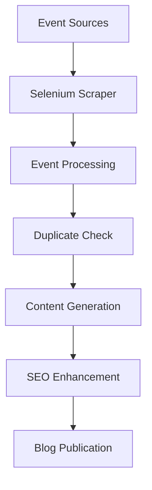

# Houston Events Blog Generator

This documentation covers the Houston events functionality added to the blog automation system, which scrapes local Houston events and generates engaging blog content about them.

## Overview

The Houston Events system extends the existing blog automation with the ability to:

- **Scrape events** from multiple Houston event websites using Selenium
- **Generate engaging content** specifically tailored for event promotion
- **Detect duplicates** to avoid repetitive content
- **Integrate seamlessly** with the existing blog workflow

## Configuration

### Environment Variables

Add these variables to your `.env` file:

```bash
# Houston Events Configuration
HOUSTON_EVENTS_ENABLED=true
HOUSTON_EVENTS_SOURCES=https://www.visithoustontexas.com/events/events-this-weekend/,https://www.houcalendar.com/
SELENIUM_HEADLESS=true
EVENT_DUPLICATE_CHECK_DAYS=30
EVENT_MIN_SCORE=0.4
```

### Configuration Options

| Variable | Description | Default |
|----------|-------------|---------|
| `HOUSTON_EVENTS_ENABLED` | Enable/disable Houston events functionality | `false` |
| `HOUSTON_EVENTS_SOURCES` | Comma-separated list of event source URLs | Empty |
| `SELENIUM_HEADLESS` | Run browser in headless mode | `true` |
| `EVENT_DUPLICATE_CHECK_DAYS` | Days to check for duplicate events | `30` |
| `EVENT_MIN_SCORE` | Minimum score for events to be considered | `0.4` |

## Usage

### Command Line Interface

Generate different types of content using the CLI:

```bash
# Generate a Houston events blog post
python -m blog_automation.cli generate --content-type events

# Generate mixed content (tech + events)
python -m blog_automation.cli generate --content-type mixed

# Generate regular tech content (default)
python -m blog_automation.cli generate --content-type tech
```

### Testing

Run the test script to verify functionality:

```bash
python test_houston_events.py
```

This will test:
- Configuration validation
- Event scraping from configured sources
- Content generation for events
- Duplicate detection system

## Features

### 1. Multi-Source Event Scraping

The system scrapes events from multiple Houston event websites:

- **Visit Houston Texas** - Official Houston tourism events
- **HouCalendar** - Comprehensive Houston event listings
- **Extensible** - Easy to add new sources

### 2. Smart Event Processing

- **Category Detection** - Automatically categorizes events (concerts, festivals, theatre, etc.)
- **Venue Recognition** - Identifies and standardizes venue information
- **Date Parsing** - Handles various date formats intelligently
- **Quality Scoring** - Ranks events based on multiple factors

### 3. Duplicate Prevention

- **Content Analysis** - Scans existing blog posts for similar events
- **Fuzzy Matching** - Uses advanced similarity detection
- **Freshness Tracking** - Monitors venue and category coverage
- **Smart Filtering** - Suggests different content angles for similar events

### 4. SEO-Optimized Content

- **Local Keywords** - Includes Houston-specific terms and locations
- **Schema Markup** - Generates structured data for events
- **Voice Search** - Optimized for conversational queries
- **Local Business** - Mentions nearby Houston landmarks and venues

## Architecture

### Core Components

```
Houston Events System
├── HoustonEventsScraper     # Web scraping with Selenium
├── EventContentGenerator    # Event-specific content creation
├── PostAnalyzer            # Duplicate detection and analysis
└── Event Data Models       # HoustonEvent, EventTrendingTopic
```

### Workflow Integration

The events system integrates with existing workflows:

1. **Events Workflow** - Pure Houston events content
2. **Mixed Workflow** - Combines tech trends with events
3. **Standard Workflow** - Original tech-focused content

### Data Flow



## Event Categories

The system recognizes and optimizes content for these event types:

- **Concerts** - Music events and live performances
- **Festivals** - Cultural celebrations and fairs
- **Theatre** - Plays, musicals, and dramatic performances
- **Family** - Kid-friendly and family events
- **Food** - Culinary events and food festivals
- **Sports** - Athletic events and competitions

## Content Personalization

The system adapts writing style based on event type:

- **Music Enthusiast** - For concerts and music events
- **Community Connector** - For festivals and cultural events
- **Arts Aficionado** - For theatre and artistic performances
- **Family Guide** - For family-friendly events
- **Foodie Insider** - For culinary experiences
- **Local Explorer** - For general Houston events

## Technical Requirements

### Dependencies

```bash
selenium>=4.15.0
webdriver-manager>=4.0.0
python-dateutil>=2.8.0
fuzzywuzzy>=0.18.0
python-levenshtein>=0.21.0
python-frontmatter>=1.0.0
```

### Browser Requirements

- Chrome browser (for Selenium WebDriver)
- Automatic ChromeDriver installation via webdriver-manager

## Troubleshooting

### Common Issues

**Selenium WebDriver Errors**
```bash
# Install/update Chrome browser
# The system will automatically download the correct ChromeDriver
```

**No Events Found**
- Check that event sources are accessible
- Verify HOUSTON_EVENTS_ENABLED=true
- Review Selenium timeout settings

**Duplicate Detection Issues**
- Ensure _posts directory exists and contains markdown files
- Check EVENT_DUPLICATE_CHECK_DAYS value
- Verify frontmatter parsing

### Debug Mode

Run with debug logging for troubleshooting:

```python
import logging
logging.basicConfig(level=logging.DEBUG)
```

## Contributing

### Adding New Event Sources

1. Add the URL to `HOUSTON_EVENTS_SOURCES`
2. Update `houston_events_scraper.py` with source-specific logic
3. Add appropriate selectors for the new site
4. Test with the test script

### Extending Categories

1. Update the `categories` list in configuration
2. Add category keywords in `_determine_category` method
3. Update content generation prompts if needed

## Performance Considerations

- **Rate Limiting** - Built-in delays between source requests
- **Headless Mode** - Runs efficiently without GUI
- **Caching** - Duplicate detection caches recent posts
- **Timeout Handling** - Graceful handling of slow-loading sites

## Security

- **No Personal Data** - Only scrapes public event information
- **Respectful Scraping** - Includes user-agent and delays
- **Error Handling** - Fails gracefully without exposing sensitive data

## Monitoring

Check system health with:

```bash
python -m blog_automation.cli status
```

This shows:
- Houston events configuration status
- Number of configured sources
- Component initialization status
- Recent activity logs 