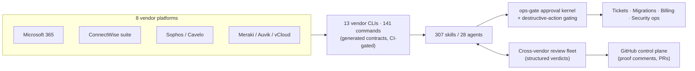

# MSP service delivery using agentic LLMs

  
<strong>In brief:</strong> How a solo services engineer re-tooled MSP work &mdash; tickets, migrations, billing, security &mdash; around typed agent CLIs, cross-vendor review, and an approval kernel, with the reconciliation numbers that back it up and the numbers deliberately left out because the evidence doesn't support them.

## Context

I work as a Sr. Services Engineer at Viyu Network Solutions, a managed IT services provider, acting as the de facto solutions architect and automation engineer for the platforms the business runs client work through. The job covers the usual MSP surface — tickets, Microsoft 365 migrations, security operations, billing, time reconciliation — spread across eight vendor platforms that share no data model and no audit trail with each other. None of them were built to talk to one another, and none of them were built to be operated by anything other than a person clicking through a console.

Over the past several months I've been re-tooling how that work actually gets done. Not by adding another dashboard on top of the existing ones, but by giving agentic LLM systems typed, auditable access to the same platforms a technician already uses, and building the review and approval machinery around them that a human operator gets for free simply by being accountable in the room. This case study describes that platform, how the work is actually reviewed before it ships, and what changed because of it — no more, no less than the evidence supports.

## The platform

The core of the system is a set of vendor CLIs, one per platform — Microsoft 365, the ConnectWise suite, Sophos and Cavelo, Meraki, Auvik, VMware vCloud, and the rest. Each CLI is hand-built and self-describing: every command exposes its own argument shape as structured JSON, and a generated-contracts pipeline reads that shape and rebuilds the platform's CLI reference automatically, checked in CI so the documentation can never quietly drift out of sync with the code. As of the most recent count, that's 13 vendor-platform CLIs carrying 141 commands (plus the platform's own CLI), 307 orchestration skills layered on top of them, and 28 named agents — counted from the generated contract and the repository itself in August 2026.

That generated-contract pattern exists for a specific reason. An agent calling a vendor API directly, or shelling out to curl, is both unauditable and expensive in tokens — and it hides platform knowledge inside a prompt instead of putting it somewhere reviewable. Routing every agent action through a designated CLI means every action taken against a client system has a name, a typed argument list, and a place in a changelog: the same discipline a good technician's runbook already has, just enforced by the interface instead of hoped for as policy.

The decision underneath the platform I'd point to first isn't a CLI at all — it's the identity model that ties the others together. Every vendor platform has its own notion of what a "client" or a "site" is, under a different ID, updated on a different schedule. Rather than reconcile that by hand every time an agent needs to act, one system's asset model serves as the cross-platform source of truth, and everything else resolves against it. It's the least visible piece of the architecture and the one that makes the rest of it legible.

There's a further step I think about even where I haven't fully built it: eventually each of these CLIs stops being a tool an agent calls and starts behaving like its own department — a vendor-scoped unit with a memory of what it has done and why, sharing that memory with the other departments through a common, swappable layer instead of stuffing it all into one prompt. I've built the early piece of that idea already: a small, pluggable memory service any agent runtime on the machine can read from and write to, independent of which vendor or model sits on top of it. The department framing is still more a way of thinking about where this goes than a shipped architecture, but it's the direction the platform is pulling toward.

## The method

None of the above is trustworthy if the same agent that makes a change is also the one that decides the change is fine. The review discipline around this platform is built to prevent exactly that. Of the several thousand agent sessions run against it over the past several months, 2,049 were role-typed subagent threads rather than direct chats — a named reviewer, planner, or executor agent spawned for one scoped piece of work — and 670 of those were specifically code-reviewer runs, each returning a structured verdict rather than a free-text opinion an orchestrator has to interpret.

The more interesting piece is the cross-vendor version of that same pattern: one agent runtime dispatching a different vendor's model to independently review the same pull request, read-only, under an identical structured contract — a verdict of approve or request-changes, backed by cited evidence. Neither side sees what the other found until both reports land, which is closer to how a second engineer's review actually functions than a single model checking its own homework ever could be.

The governance layer that ties all of this together runs through GitHub Projects, treated as the enforced system of record rather than a nice-to-have. Every piece of agent work is attributed to an issue, and closing that issue requires a linked pull request and a comment that shows, concretely, what was done — the same paper trail a human technician's change record would carry, just harder to skip when a script is the one checking for it.

## The guardrails

None of this is safe to run against production client systems without a floor under it, and that floor came from real incidents, not from foresight. Typed confirmation before any destructive action, an approval kernel sitting in front of billing and security writes, and an independent re-read of system state before an agent is allowed to report that a write succeeded — all three exist because something specific went wrong first and got turned into a rule afterward. I've written about how those failures became standing protocol in [A write is a claim, not evidence](/notes/agent-safety); this case study assumes that protocol as the baseline everything else in it sits on top of.

## What it changed

The clearest, most measurable change is in an unglamorous corner of the work: daily timesheet and billing reconciliation. What used to require someone checking logged time against actual work each day now runs mostly unattended, as a scheduled agent routine. Time-entry compliance rose from 21.0 to 24.25 logged days per month — a change temporally consistent with the reconciler's adoption (+15%, CWM data H2-2025 vs 2026) — the one number in this piece I can point to a data source for and defend if asked.

Billing is the second place the change is real, and here I'll describe it rather than quantify it, because that's what the evidence actually supports. Sole operation of a six-figure-monthly cloud-billing process moved off a set of manual, per-client spreadsheet calculators and into an automated pipeline. Before that pipeline touched production, it ran in shadow against the existing manual process long enough that the gap between the two narrowed to a small, single-digit percentage, and it only went live behind a tiered approval chain with rollback available at every stage.

I'm deliberately not printing a ticket-throughput or per-ticket time figure anywhere in this piece. The data I have for that period doesn't cleanly separate the effect of the tooling from the effect of a role change happening in the same window, and a number I can't defend under a follow-up question isn't worth printing. What I can say plainly is that the reconciliation and billing work above now runs as unattended, evidence-producing pipelines instead of manual passes, with a person approving the consequential steps instead of performing all of them.

## Architecture

Eight vendor platforms behind thirteen typed CLIs, feeding the skills and agents that do the work; every consequential action passes through the approval kernel before it lands, and every change passes through the review fleet and the GitHub control plane before it counts as done.
