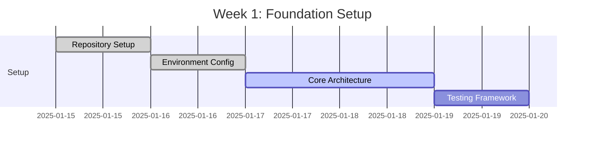
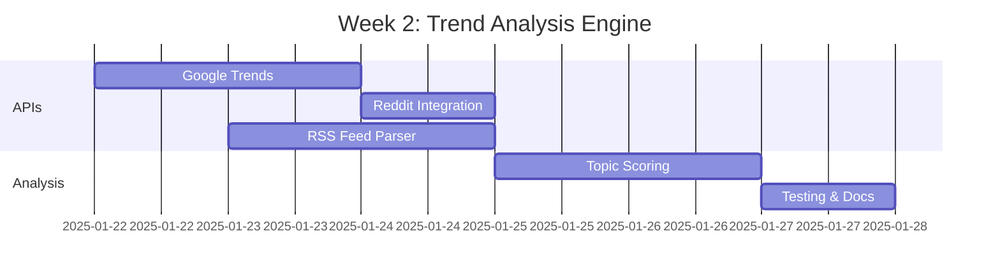
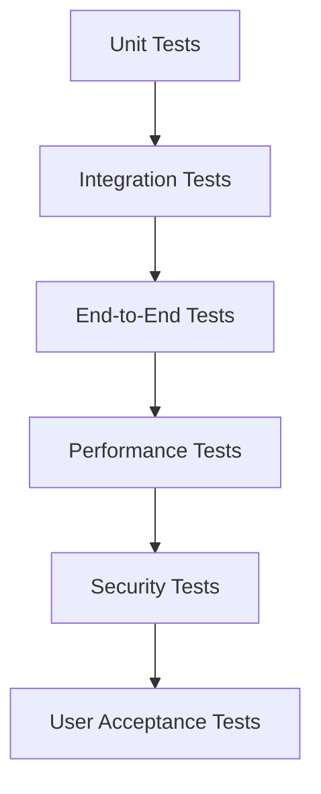

# Development Roadmap
## Automated Content Generation System

**Document Version:** 1.0  
**Date:** January 2025  
**Author:** Development Team  
**Project Timeline:** 8 Weeks  

---

## 1. Project Overview

### 1.1 Development Approach
- **Methodology:** Agile development with 2-week sprints
- **Total Duration:** 8 weeks (4 sprints)
- **Team Size:** 1-2 developers
- **Deployment Strategy:** Continuous integration with staged releases

### 1.2 Success Criteria
- ✅ Generate 3-5 professional blog posts per week
- ✅ 95%+ successful publication rate to GitHub
- ✅ Integration of relevant Amazon affiliate products
- ✅ 99%+ system uptime on DigitalOcean platform
- ✅ Full compliance with security requirements

---

## 2. Development Phases

### Phase 1: Foundation & Core Architecture (Weeks 1-2)

#### Sprint 1.1: Project Setup & Core Infrastructure
**Duration:** Week 1  
**Sprint Goal:** Establish development environment and core project structure

**Week 1 Tasks:**
- [ ] **Day 1-2: Project Setup**
  - Set up GitHub repository with branch protection
  - Configure development environment (Python 3.11, virtual environment)
  - Create initial project structure and documentation
  - Set up pre-commit hooks and code quality tools

- [ ] **Day 3-4: Core Architecture Implementation**
  - Implement base configuration management system
  - Create core data models and schemas
  - Set up logging and monitoring infrastructure
  - Implement basic error handling framework

- [ ] **Day 5: Testing & Documentation**
  - Write unit tests for core components
  - Set up automated testing pipeline
  - Document API interfaces and data models
  - Sprint review and retrospective

**Deliverables:**
- ✅ Working development environment
- ✅ Core project structure with documentation
- ✅ Basic configuration and logging systems
- ✅ Unit test framework and CI/CD pipeline

#### Sprint 1.2: Trend Analysis Engine
**Duration:** Week 2  
**Sprint Goal:** Implement trend analysis and topic selection capabilities

**Week 2 Tasks:**
- [ ] **Day 1-2: External API Integration**
  - Implement Google Trends API integration
  - Set up Reddit API client (PRAW)
  - Create RSS feed parser for tech publications
  - Add rate limiting and error handling

- [ ] **Day 3-4: Topic Analysis & Scoring**
  - Implement topic relevance scoring algorithm
  - Create content freshness evaluation system
  - Add competition analysis for topic selection
  - Develop fallback topic generation

- [ ] **Day 5: Testing & Optimization**
  - Write comprehensive tests for trend analysis
  - Performance optimization and caching
  - Integration testing with mock data
  - Documentation and code review

**Deliverables:**
- ✅ Functional trend analysis engine
- ✅ Integration with Google Trends, Reddit, and RSS feeds
- ✅ Topic scoring and selection algorithms
- ✅ Comprehensive test coverage

**Phase 1 Milestone:** Core infrastructure and trend analysis system operational

---

### Phase 2: Content Generation & AI Integration (Weeks 3-4)

#### Sprint 2.1: OpenAI Integration & Content Generation
**Duration:** Week 3  
**Sprint Goal:** Implement AI-powered content generation with OpenAI GPT-4

**Week 3 Tasks:**
- [ ] **Day 1-2: OpenAI API Integration**
  - Set up OpenAI API client with authentication
  - Implement rate limiting and retry logic
  - Create content prompt templates
  - Add response validation and parsing

- [ ] **Day 3-4: Content Generation Engine**
  - Develop structured prompt creation system
  - Implement content quality validation
  - Add Jekyll front matter generation
  - Create content formatting and sanitization

- [ ] **Day 5: Testing & Quality Assurance**
  - Unit tests for content generation
  - Integration tests with OpenAI API
  - Content quality validation testing
  - Performance benchmarking

**Deliverables:**
- ✅ OpenAI API integration with error handling
- ✅ Content generation engine with quality validation
- ✅ Jekyll-compatible front matter generation
- ✅ Comprehensive testing and documentation

#### Sprint 2.2: Amazon Affiliate Integration
**Duration:** Week 4  
**Sprint Goal:** Implement Amazon product search and affiliate link generation

**Week 4 Tasks:**
- [ ] **Day 1-2: Amazon Product Search**
  - Implement web scraping for Amazon product search
  - Create product data extraction and parsing
  - Add product relevance scoring
  - Implement caching for product data

- [ ] **Day 3-4: Affiliate Link Management**
  - Create affiliate link generation with store ID
  - Implement product recommendation engine
  - Add natural content integration for products
  - Create affiliate disclosure system

- [ ] **Day 5: Integration & Testing**
  - Integrate affiliate system with content generator
  - End-to-end testing of content with products
  - Performance optimization and error handling
  - Compliance validation and documentation

**Deliverables:**
- ✅ Amazon product search and extraction system
- ✅ Affiliate link generation with store ID integration
- ✅ Product recommendation and content integration
- ✅ Compliance-ready affiliate disclosure system

**Phase 2 Milestone:** Complete content generation pipeline with affiliate integration

---

### Phase 3: Publication & GitHub Integration (Weeks 5-6)

#### Sprint 3.1: GitHub Repository Integration
**Duration:** Week 5  
**Sprint Goal:** Implement automated publishing to GitHub repository

**Week 5 Tasks:**
- [ ] **Day 1-2: GitHub API Integration**
  - Set up GitHub API client with authentication
  - Implement repository content management
  - Add file creation and update capabilities
  - Create conflict resolution mechanisms

- [ ] **Day 3-4: Publication System**
  - Develop SEO-friendly filename generation
  - Implement duplicate post detection
  - Add commit message generation
  - Create publication status tracking

- [ ] **Day 5: Testing & Validation**
  - Integration tests with GitHub API
  - End-to-end publication testing
  - Error handling and retry logic
  - Documentation and security review

**Deliverables:**
- ✅ GitHub API integration with full CRUD operations
- ✅ Automated publication system to _posts directory
- ✅ Duplicate detection and conflict resolution
- ✅ Comprehensive error handling and logging

#### Sprint 3.2: System Orchestration & Workflow
**Duration:** Week 6  
**Sprint Goal:** Integrate all components into cohesive content generation workflow

**Week 6 Tasks:**
- [ ] **Day 1-2: Main Orchestrator Implementation**
  - Create content generation workflow orchestrator
  - Implement scheduling and timing logic
  - Add health check and monitoring systems
  - Create manual trigger capabilities

- [ ] **Day 3-4: Error Handling & Recovery**
  - Implement comprehensive error handling
  - Add retry logic and circuit breakers
  - Create graceful degradation mechanisms
  - Add system metrics and monitoring

- [ ] **Day 5: Integration Testing**
  - End-to-end system testing
  - Performance testing and optimization
  - Security validation and testing
  - Documentation and code review

**Deliverables:**
- ✅ Complete content generation orchestrator
- ✅ Robust error handling and recovery systems
- ✅ Health monitoring and metrics collection
- ✅ End-to-end system integration

**Phase 3 Milestone:** Fully integrated system ready for deployment

---

### Phase 4: Deployment & Production Readiness (Weeks 7-8)

#### Sprint 4.1: DigitalOcean Deployment
**Duration:** Week 7  
**Sprint Goal:** Deploy system to DigitalOcean App Platform with full monitoring

**Week 7 Tasks:**
- [ ] **Day 1-2: Deployment Configuration**
  - Create DigitalOcean App Platform configuration
  - Set up environment variables and secrets
  - Configure health checks and monitoring
  - Implement security headers and CORS

- [ ] **Day 3-4: Production Deployment**
  - Deploy to DigitalOcean staging environment
  - Set up CI/CD pipeline with GitHub Actions
  - Configure monitoring and alerting
  - Performance testing in production environment

- [ ] **Day 5: Security & Compliance**
  - Security audit and penetration testing
  - Compliance validation (GDPR, affiliate regulations)
  - Final security configuration
  - Documentation and runbook creation

**Deliverables:**
- ✅ Production deployment on DigitalOcean App Platform
- ✅ CI/CD pipeline with automated deployments
- ✅ Comprehensive monitoring and alerting
- ✅ Security audit and compliance validation

#### Sprint 4.2: Production Optimization & Launch
**Duration:** Week 8  
**Sprint Goal:** Optimize system performance and launch production operations

**Week 8 Tasks:**
- [ ] **Day 1-2: Performance Optimization**
  - Performance profiling and optimization
  - Resource usage optimization for cost efficiency
  - Cache optimization and tuning
  - Load testing and capacity planning

- [ ] **Day 3-4: Production Launch**
  - Production launch with monitoring
  - Initial content generation validation
  - System performance monitoring
  - User acceptance testing and validation

- [ ] **Day 5: Documentation & Handover**
  - Complete system documentation
  - Create operational runbooks
  - Knowledge transfer and training
  - Project retrospective and lessons learned

**Deliverables:**
- ✅ Optimized production system
- ✅ Successful production launch with content generation
- ✅ Complete documentation and runbooks
- ✅ System monitoring and maintenance procedures

**Phase 4 Milestone:** Production system fully operational and generating content

---

## 3. Detailed Implementation Plan

### 3.1 Week-by-Week Breakdown

#### Week 1: Project Foundation


**Key Activities:**
- Initialize GitHub repository with proper branch protection
- Set up development environment with Python 3.11
- Implement core configuration management
- Create logging and monitoring infrastructure
- Set up unit testing framework

**Risk Mitigation:**
- Daily standup meetings to track progress
- Parallel development of independent components
- Early integration testing to catch compatibility issues

#### Week 2: Trend Analysis Implementation


**Key Activities:**
- Integrate with Google Trends API using pytrends
- Set up Reddit API client for hot topic monitoring
- Implement RSS feed parsing for tech publications
- Develop topic relevance scoring algorithm
- Create comprehensive test suite

**Risk Mitigation:**
- API rate limiting implementation from day one
- Fallback mechanisms for API failures
- Extensive error handling and logging

#### Week 3: Content Generation Engine
```python
# Example implementation timeline
class ContentGenerationTimeline:
    def week_3_schedule(self):
        return {
            "Day 1": "OpenAI API client setup and authentication",
            "Day 2": "Prompt template creation and testing",
            "Day 3": "Content parsing and validation",
            "Day 4": "Jekyll front matter generation",
            "Day 5": "Integration testing and optimization"
        }
```

**Key Activities:**
- Implement OpenAI GPT-4 API integration
- Create structured prompt templates for content generation
- Add content quality validation and sanitization
- Generate Jekyll-compatible front matter
- Performance testing and optimization

#### Week 4: Affiliate Integration
**Key Activities:**
- Implement Amazon product search using web scraping
- Create affiliate link generation with store ID (sghpgs-20)
- Develop product recommendation algorithms
- Add natural product integration into content
- Ensure compliance with affiliate disclosure requirements

#### Week 5-6: GitHub Integration & Orchestration
**Key Activities:**
- GitHub API integration for repository management
- Automated publication to _posts directory
- Complete system orchestration and workflow
- Error handling and recovery mechanisms
- Health monitoring and metrics collection

#### Week 7-8: Deployment & Production
**Key Activities:**
- DigitalOcean App Platform deployment configuration
- Production environment setup with monitoring
- Security audit and compliance validation
- Performance optimization and load testing
- Production launch and operational handover

### 3.2 Risk Management Strategy

#### High-Risk Items
1. **OpenAI API Rate Limiting**
   - **Risk:** API quota exhaustion affecting content generation
   - **Mitigation:** Implement intelligent rate limiting and queue management
   - **Contingency:** Fallback to template-based content generation

2. **Amazon Anti-Scraping Measures**
   - **Risk:** Amazon blocking product search requests
   - **Mitigation:** Rotating user agents, request delays, proxy rotation
   - **Contingency:** Curated product database for fallback recommendations

3. **GitHub API Integration Complexity**
   - **Risk:** Complex Git operations causing publication failures
   - **Mitigation:** Atomic operations, comprehensive error handling
   - **Contingency:** Manual intervention procedures and retry mechanisms

#### Medium-Risk Items
1. **Content Quality Consistency**
   - **Risk:** Generated content not meeting professional standards
   - **Mitigation:** Multiple validation layers and quality checks
   - **Contingency:** Human review process for critical content

2. **DigitalOcean Platform Limitations**
   - **Risk:** Resource constraints affecting system performance
   - **Mitigation:** Efficient resource utilization and monitoring
   - **Contingency:** Optimization strategies and scaling options

### 3.3 Quality Assurance Strategy

#### Testing Approach


#### Test Coverage Requirements
- **Unit Tests:** >90% code coverage
- **Integration Tests:** All external API interactions
- **End-to-End Tests:** Complete content generation workflow
- **Performance Tests:** Sub-5-minute generation time
- **Security Tests:** All input validation and authentication flows

#### Code Quality Standards
- **Code Review:** All code must be reviewed before merge
- **Static Analysis:** Automated code quality checks with pylint/flake8
- **Documentation:** Comprehensive docstrings and API documentation
- **Security Scanning:** Automated dependency vulnerability scanning

---

## 4. Resource Requirements

### 4.1 Development Tools & Services
- **Development Environment:** Python 3.11, PyCharm/VSCode
- **Version Control:** GitHub with Actions for CI/CD
- **Testing:** pytest, coverage.py, mock
- **Monitoring:** DigitalOcean monitoring, custom logging
- **Documentation:** Markdown, Mermaid diagrams

### 4.2 External Service Dependencies
- **OpenAI API:** GPT-4 access with sufficient quota
- **GitHub API:** Personal access token with repository write access
- **Reddit API:** Application credentials for data access
- **DigitalOcean:** App Platform account with deployment capabilities
- **Google Trends:** Indirect access via pytrends library

### 4.3 Budget Considerations
- **DigitalOcean App Platform:** ~$5/month for basic tier
- **OpenAI API Usage:** ~$20-50/month based on generation frequency
- **Development Tools:** Free tier options available
- **Total Monthly Operating Cost:** ~$25-55

---

## 5. Success Metrics & KPIs

### 5.1 Development Phase KPIs
- **Sprint Velocity:** Consistent story point completion
- **Code Quality:** Maintainability index >80
- **Test Coverage:** >90% across all components
- **Bug Escape Rate:** <5% of bugs found in production

### 5.2 Production Performance KPIs
- **Content Generation Success Rate:** >95%
- **Average Generation Time:** <5 minutes per post
- **System Uptime:** >99%
- **API Error Rate:** <1%

### 5.3 Business Impact Metrics
- **Posts Published:** 15-20 per month
- **Affiliate Click-Through Rate:** Measurable within 30 days
- **Content Quality Score:** Professional review rating >8/10
- **Cost Per Post:** <$3 including all operational costs

---

## 6. Post-Launch Roadmap

### 6.1 Phase 5: Optimization & Enhancement (Months 2-3)
- **Content Performance Analytics:** Track engagement and optimization
- **Machine Learning Integration:** Learn from successful content patterns
- **Advanced Product Matching:** Improve affiliate product relevance
- **Multi-Platform Publishing:** Extend to social media platforms

### 6.2 Phase 6: Scaling & Advanced Features (Months 4-6)
- **Multi-Language Support:** Content generation in multiple languages
- **Advanced SEO Optimization:** Keyword research and optimization
- **Content Calendar Integration:** Strategic content planning
- **Revenue Analytics:** Detailed affiliate performance tracking

### 6.3 Long-term Vision (6+ Months)
- **AI-Powered Content Strategy:** Predictive content planning
- **Multi-Site Management:** Support for multiple portfolio sites
- **Advanced Personalization:** Audience-specific content generation
- **Marketplace Integration:** Expand beyond Amazon affiliate program

This comprehensive development roadmap provides clear milestones, deliverables, and success criteria for the entire project lifecycle, ensuring systematic progress toward a production-ready automated content generation system. 