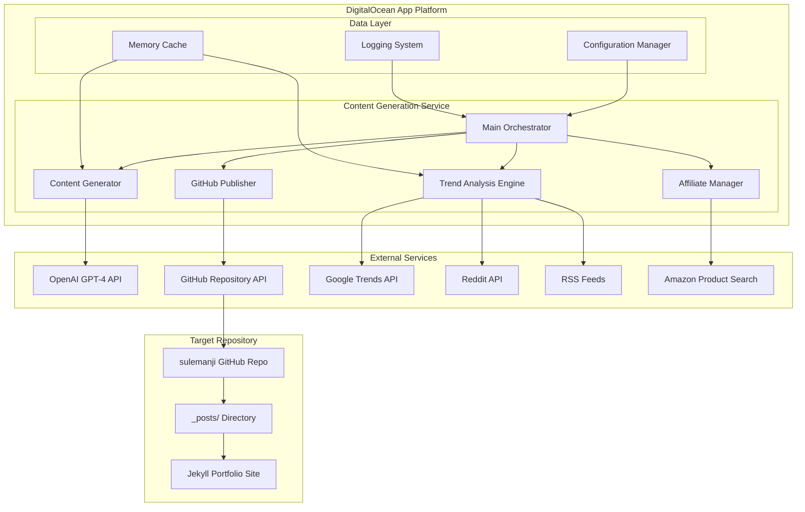
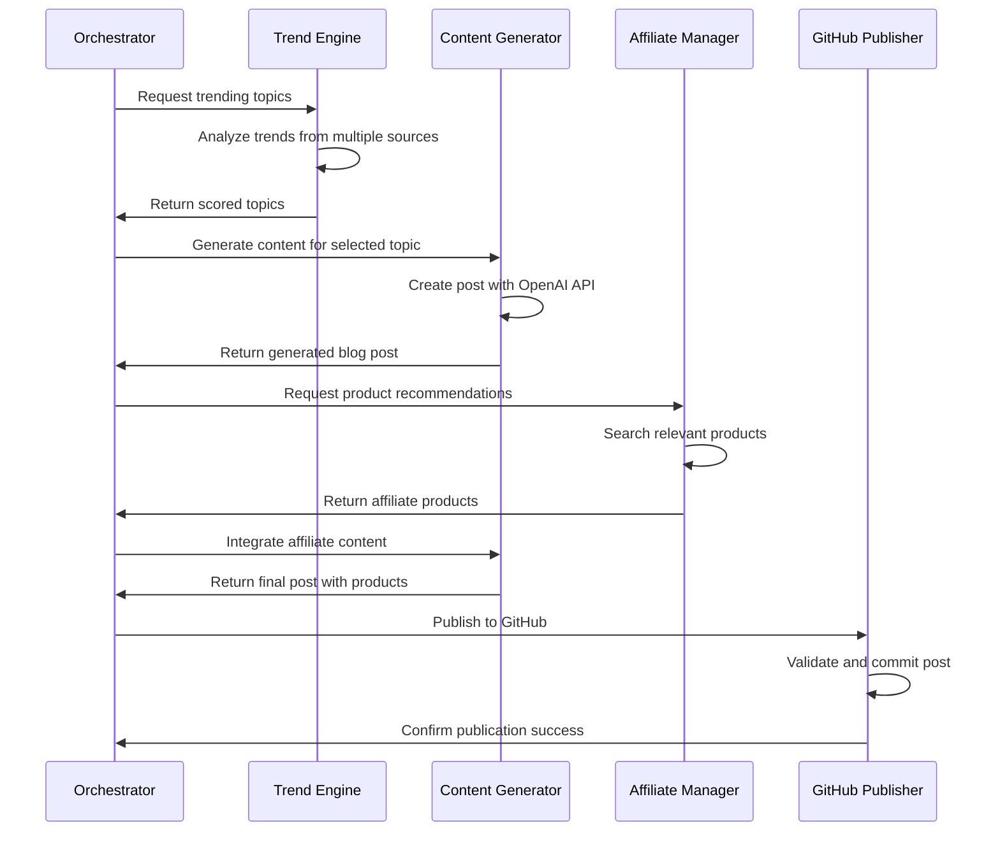
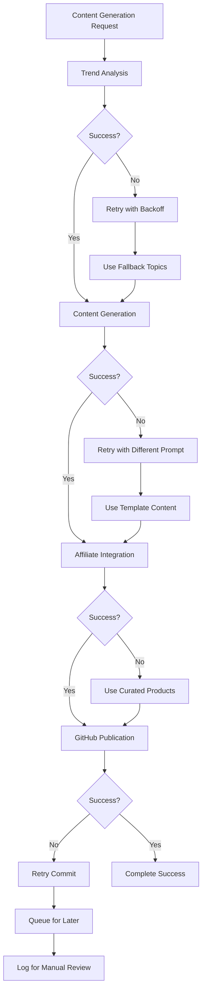

# Software Architecture Document (SAD)
## Automated Content Generation System

**Document Version:** 1.0  
**Date:** January 2025  
**Author:** Development Team  
**Project:** Suleman Anji Portfolio Content Automation  

---

## 1. Architecture Overview

### 1.1 System Purpose
The Automated Content Generation System is a microservice-based application that generates contextual blog posts with integrated Amazon affiliate links for www.sulemanji.com. The system operates autonomously on DigitalOcean App Platform, producing 15-20 professional-grade posts monthly.

### 1.2 Architectural Principles
- **Modularity:** Loosely coupled components for independent development and testing
- **Scalability:** Horizontally scalable architecture supporting increased content volume
- **Reliability:** Fault-tolerant design with comprehensive error handling
- **Maintainability:** Clear separation of concerns with well-defined interfaces
- **Security:** Secure handling of API keys and sensitive data

### 1.3 High-Level Architecture



---

## 2. Component Architecture

### 2.1 Main Orchestrator (`main.py`)

**Purpose:** Central coordination of content generation workflow

**Responsibilities:**
- Schedule and trigger content generation cycles
- Coordinate interaction between all system components
- Handle system-level error recovery and logging
- Manage configuration and environment variables

**Key Methods:**
```python
class ContentOrchestrator:
    def __init__(self)
    def run_generation_cycle(self) -> bool
    def schedule_content_generation(self)
    def health_check(self) -> Dict[str, Any]
    def handle_failure(self, error: Exception)
```

**Configuration Interface:**
```python
@dataclass
class SystemConfig:
    openai_api_key: str
    github_token: str
    github_repo: str
    store_id: str = "sghpgs-20"
    content_frequency: str = "daily"
    posts_per_cycle: int = 1
    min_word_count: int = 1200
    max_word_count: int = 1500
```

### 2.2 Trend Analysis Engine (`trend_engine.py`)

**Purpose:** Identify and prioritize content topics based on trending technology discussions

**Responsibilities:**
- Monitor Google Trends for technology keywords
- Parse RSS feeds from major tech publications
- Analyze Reddit and Hacker News discussions
- Score and rank topics for content generation priority
- Maintain topic freshness and avoid duplication

**Architecture:**
```python
class TrendAnalysisEngine:
    def __init__(self, config: TrendConfig)
    def analyze_google_trends(self) -> List[TrendingTopic]
    def parse_rss_feeds(self) -> List[NewsItem]
    def monitor_reddit_discussions(self) -> List[Discussion]
    def score_topics(self, topics: List[Topic]) -> List[ScoredTopic]
    def select_next_topic(self) -> Optional[Topic]
```

**Data Models:**
```python
@dataclass
class TrendingTopic:
    keyword: str
    trend_score: float
    search_volume: int
    related_terms: List[str]
    timestamp: datetime
    source: str

@dataclass
class ScoredTopic:
    topic: TrendingTopic
    relevance_score: float
    freshness_score: float
    competition_score: float
    final_score: float
```

### 2.3 Content Generator (`content_generator.py`)

**Purpose:** Generate high-quality blog posts using OpenAI GPT-4 with contextual relevance

**Responsibilities:**
- Interface with OpenAI API for content generation
- Maintain consistent voice and professional tone
- Generate Jekyll-compatible front matter
- Ensure content length and quality standards
- Handle API rate limiting and error recovery

**Architecture:**
```python
class ContentGenerator:
    def __init__(self, config: OpenAIConfig)
    def generate_post(self, topic: Topic) -> BlogPost
    def create_jekyll_frontmatter(self, post: BlogPost) -> str
    def validate_content_quality(self, content: str) -> bool
    def handle_rate_limiting(self)
```

**Content Templates:**
```python
@dataclass
class BlogPost:
    title: str
    content: str
    excerpt: str
    category: str
    tags: List[str]
    author: str
    date: datetime
    affiliate_products: List[Product]
    
@dataclass
class ContentPrompt:
    topic: str
    target_audience: str
    word_count_range: Tuple[int, int]
    tone: str
    include_code_examples: bool
    product_integration_points: List[str]
```

### 2.4 Affiliate Manager (`affiliate_manager.py`)

**Purpose:** Handle Amazon affiliate link generation and product recommendations

**Responsibilities:**
- Search Amazon for relevant products
- Generate affiliate links with proper store ID
- Curate product recommendations for content topics
- Maintain product database for fallback recommendations
- Handle affiliate disclosure requirements

**Architecture:**
```python
class AffiliateManager:
    def __init__(self, store_id: str = "sghpgs-20")
    def search_products(self, keywords: List[str]) -> List[Product]
    def generate_affiliate_link(self, product: Product) -> str
    def select_relevant_products(self, content_topic: str) -> List[Product]
    def create_product_recommendations(self, products: List[Product]) -> str
    def get_affiliate_disclosure(self) -> str
```

**Product Data Models:**
```python
@dataclass
class Product:
    title: str
    asin: str
    price: Optional[str]
    rating: Optional[float]
    category: str
    image_url: Optional[str]
    description: str
    
@dataclass
class ProductRecommendation:
    product: Product
    affiliate_link: str
    recommendation_text: str
    placement_context: str
```

### 2.5 GitHub Publisher (`github_publisher.py`)

**Purpose:** Automate publishing of generated content to GitHub repository

**Responsibilities:**
- Authenticate with GitHub API
- Check for existing posts to prevent duplicates
- Generate SEO-friendly filenames
- Commit posts to _posts directory
- Handle Git operations and conflict resolution

**Architecture:**
```python
class GitHubPublisher:
    def __init__(self, config: GitHubConfig)
    def authenticate(self) -> bool
    def check_existing_posts(self, title: str) -> bool
    def generate_filename(self, post: BlogPost) -> str
    def publish_post(self, post: BlogPost) -> bool
    def handle_commit_conflicts(self)
```

**GitHub Integration:**
```python
@dataclass
class GitHubConfig:
    token: str
    repository: str
    branch: str = "main"
    posts_directory: str = "_posts"
    commit_message_template: str = "Auto-generated post: {title}"
```

---

## 3. Data Flow Architecture

### 3.1 Content Generation Workflow



### 3.2 Error Handling Flow



---

## 4. Security Architecture

### 4.1 API Key Management

**Strategy:** Environment variables with encryption at rest
**Implementation:**
```python
class SecureConfig:
    def __init__(self):
        self.openai_key = self._get_encrypted_env('OPENAI_API_KEY')
        self.github_token = self._get_encrypted_env('GITHUB_TOKEN')
    
    def _get_encrypted_env(self, key: str) -> str:
        encrypted_value = os.getenv(key)
        return self._decrypt(encrypted_value)
```

### 4.2 Rate Limiting and Abuse Prevention

**OpenAI API Protection:**
```python
class RateLimiter:
    def __init__(self, max_requests: int, time_window: int):
        self.max_requests = max_requests
        self.time_window = time_window
        self.requests = deque()
    
    def can_make_request(self) -> bool:
        current_time = time.time()
        # Remove old requests
        while self.requests and current_time - self.requests[0] > self.time_window:
            self.requests.popleft()
        
        return len(self.requests) < self.max_requests
```

### 4.3 Input Validation and Sanitization

**Content Validation:**
```python
class ContentValidator:
    def validate_topic(self, topic: str) -> bool:
        # Prevent injection attacks in topic strings
        if re.search(r'[<>"\'\&]', topic):
            return False
        return len(topic.strip()) > 0
    
    def sanitize_content(self, content: str) -> str:
        # Remove potentially harmful content
        sanitized = html.escape(content)
        return sanitized
```

---

## 5. Performance Architecture

### 5.1 Caching Strategy

**In-Memory Caching:**
```python
class CacheManager:
    def __init__(self):
        self.trend_cache = TTLCache(maxsize=100, ttl=3600)  # 1 hour
        self.product_cache = TTLCache(maxsize=500, ttl=86400)  # 24 hours
    
    def cache_trending_topics(self, topics: List[TrendingTopic]):
        cache_key = f"trends_{datetime.now().strftime('%Y%m%d%H')}"
        self.trend_cache[cache_key] = topics
```

### 5.2 Async Operations

**Concurrent API Calls:**
```python
import asyncio
import aiohttp

class AsyncTrendAnalyzer:
    async def gather_all_trends(self) -> List[TrendingTopic]:
        async with aiohttp.ClientSession() as session:
            tasks = [
                self.fetch_google_trends(session),
                self.fetch_reddit_trends(session),
                self.fetch_rss_feeds(session)
            ]
            results = await asyncio.gather(*tasks, return_exceptions=True)
            return self.merge_trend_data(results)
```

### 5.3 Resource Optimization

**Memory Management:**
```python
class ResourceManager:
    def __init__(self):
        self.max_memory_mb = 512  # DigitalOcean limit
        self.max_content_cache = 50
    
    def cleanup_resources(self):
        # Clear old cache entries
        # Release unused memory
        # Close inactive connections
        pass
```

---

## 6. Deployment Architecture

### 6.1 DigitalOcean App Platform Configuration

**App Spec (`app.yaml`):**
```yaml
name: content-generation-system
services:
- name: content-generator
  source_dir: /
  github:
    repo: sulemanji/content-automation
    branch: main
    deploy_on_push: true
  run_command: python main.py
  environment_slug: python
  instance_count: 1
  instance_size_slug: basic-xxs
  envs:
  - key: OPENAI_API_KEY
    scope: RUN_TIME
    type: SECRET
  - key: GITHUB_TOKEN
    scope: RUN_TIME
    type: SECRET
  - key: STORE_ID
    value: sghpgs-20
  - key: GENERATION_SCHEDULE
    value: "0 9 * * *"  # Daily at 9 AM
```

### 6.2 Container Architecture

**Dockerfile:**
```dockerfile
FROM python:3.11-slim

WORKDIR /app

COPY requirements.txt .
RUN pip install --no-cache-dir -r requirements.txt

COPY . .

EXPOSE 8080

CMD ["python", "main.py"]
```

### 6.3 Monitoring and Health Checks

**Health Check Endpoint:**
```python
from flask import Flask, jsonify

app = Flask(__name__)

@app.route('/health')
def health_check():
    return jsonify({
        'status': 'healthy',
        'timestamp': datetime.utcnow().isoformat(),
        'services': {
            'openai': check_openai_connection(),
            'github': check_github_connection(),
            'trend_analysis': check_trend_services()
        }
    })
```

---

## 7. Integration Patterns

### 7.1 External API Integration

**Retry Pattern with Exponential Backoff:**
```python
import time
import random

class APIClient:
    def __init__(self, max_retries: int = 3):
        self.max_retries = max_retries
    
    def call_with_retry(self, api_call, *args, **kwargs):
        for attempt in range(self.max_retries):
            try:
                return api_call(*args, **kwargs)
            except Exception as e:
                if attempt == self.max_retries - 1:
                    raise e
                
                delay = (2 ** attempt) + random.uniform(0, 1)
                time.sleep(delay)
```

### 7.2 Circuit Breaker Pattern

**Service Protection:**
```python
class CircuitBreaker:
    def __init__(self, failure_threshold: int = 5, timeout: int = 60):
        self.failure_threshold = failure_threshold
        self.timeout = timeout
        self.failure_count = 0
        self.last_failure_time = None
        self.state = "CLOSED"  # CLOSED, OPEN, HALF_OPEN
    
    def call(self, func, *args, **kwargs):
        if self.state == "OPEN":
            if time.time() - self.last_failure_time < self.timeout:
                raise Exception("Circuit breaker is OPEN")
            else:
                self.state = "HALF_OPEN"
        
        try:
            result = func(*args, **kwargs)
            if self.state == "HALF_OPEN":
                self.state = "CLOSED"
                self.failure_count = 0
            return result
        except Exception as e:
            self.failure_count += 1
            self.last_failure_time = time.time()
            
            if self.failure_count >= self.failure_threshold:
                self.state = "OPEN"
            
            raise e
```

---

## 8. Quality Attributes

### 8.1 Scalability Measures
- **Horizontal Scaling:** Stateless design enables multiple instance deployment
- **Load Distribution:** Async operations prevent blocking on external API calls
- **Resource Efficiency:** Memory-conscious design within DigitalOcean constraints

### 8.2 Reliability Measures
- **Fault Tolerance:** Circuit breakers and retry logic for external dependencies
- **Graceful Degradation:** Fallback mechanisms for all critical operations
- **Data Consistency:** Atomic commits to prevent partial content publication

### 8.3 Maintainability Measures
- **Modular Design:** Clear separation between trend analysis, content generation, and publishing
- **Configuration Management:** Environment-driven configuration for easy deployment changes
- **Comprehensive Logging:** Structured logging for debugging and monitoring

### 8.4 Security Measures
- **API Security:** Secure token management and rate limiting
- **Input Validation:** Sanitization of all external data inputs
- **Audit Trail:** Comprehensive logging of all system operations

---

## 9. Technology Stack

### 9.1 Core Technologies
- **Runtime:** Python 3.11
- **Framework:** Flask (for health checks and webhooks)
- **HTTP Client:** aiohttp for async operations
- **Scheduling:** APScheduler for cron-like functionality

### 9.2 External APIs
- **Content Generation:** OpenAI GPT-4 API
- **Version Control:** GitHub REST API
- **Trend Analysis:** Google Trends API, Reddit API
- **Product Search:** Amazon product search (web scraping)

### 9.3 Deployment Platform
- **Platform:** DigitalOcean App Platform
- **Container:** Docker containerization
- **CI/CD:** GitHub Actions integration
- **Monitoring:** DigitalOcean monitoring and alerts

---

## 10. Future Enhancements

### 10.1 Planned Improvements
- **Machine Learning:** Content performance analysis for topic optimization
- **Multi-language Support:** Content generation in multiple languages
- **Social Media Integration:** Cross-posting to social platforms
- **Advanced Analytics:** Detailed performance metrics and reporting

### 10.2 Scalability Roadmap
- **Database Integration:** Move from memory caching to persistent storage
- **Message Queue:** Implement queue-based processing for high-volume scenarios
- **Microservices:** Split into dedicated services for each major component
- **API Gateway:** Centralized API management and rate limiting

This architecture provides a robust, scalable foundation for automated content generation while maintaining security, reliability, and performance standards suitable for production deployment. 