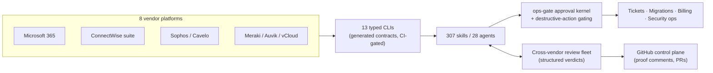

# Professional Presentation Program Implementation Plan

> **For agentic workers:** REQUIRED SUB-SKILL: Use superpowers:subagent-driven-development (recommended) or superpowers:executing-plans to implement this plan task-by-task. Steps use checkbox (`- [ ]`) syntax for tracking.

**Goal:** Turn the evidence in `~/Documents/GitHub/portfolio-audit/2026-08-30/` into a current resume (page + regenerated PDF), a positioned site with its first case study and field note, verified public claims, and a releasable hermes-mem0 — with every outward-facing change landing via PR for owner approval, never direct publish.

**Architecture:** The site's existing CI content-gate pattern (`scripts/verify_*.py`, run in `.github/workflows/jekyll.yml`) is the "test suite" for content work: every content task first extends a verifier (red), then writes the content (green), then commits. Evidence tasks run before content tasks because the audit's `do-not-claim.md` forbids printing unvalidated numbers. All work on feature branches → PRs; `main` deploys automatically, so **merge = publish = owner-only action**.

**Tech Stack:** Jekyll (GitHub Pages workflow build), Python 3 verifier scripts, Chrome headless for PDF generation, bash/npm for evidence checks. Sources of truth: `portfolio-audit/2026-08-30/{resume-opportunities,portfolio-opportunities,do-not-claim,evidence-ledger.jsonl,site-gap-analysis}.md`.

**Repos touched:** `~/Documents/GitHub/sulemanji` (Tasks 1–10), `~/Documents/GitHub/hermes-mem0` (Task 11 — separable; skip without affecting Tasks 1–10).

**Hard rules carried from the audit (read `portfolio-audit/2026-08-30/do-not-claim.md` before any content task):** no client names from the do-not-claim list; no trading performance; no hours-saved/throughput claims (only the +15% time-entry-compliance figure, phrased exactly as in resume-opportunities #9); no AlgaPSA/Hermes-Agent authorship claims; migration user/GB numbers only if Task 3 validates them; "~$130K/mo" billing framed as "six-figure monthly process automation" with no personnel story.

---

## Phase 0 — Evidence gates (Tasks 1–4). Run first; Tasks 5+ depend on their outputs.

### Task 1: Public-safety verifier (the content "test suite")

**Files:**
- Create: `scripts/verify_public_safety.py`
- Modify: `.github/workflows/jekyll.yml` (add one step after "Verify Viyu positioning", line ~58)

- [ ] **Step 1: Write the verifier (it must FAIL if forbidden strings appear in any public page)**

```python
#!/usr/bin/env python3
"""Blocks publication of confidential names/claims identified in portfolio-audit/2026-08-30/do-not-claim.md."""
from pathlib import Path
import re
import sys

ROOT = Path(__file__).resolve().parents[1]
PUBLIC_GLOBS = ["*.md", "*.html", "writing/*.md", "case-studies/*.md", "notes/*.md"]
EXCLUDE_DIRS = {"_site", "vendor", "docs", "node_modules", ".git", "blog_automation", "worker"}

FORBIDDEN = [
    (r"\bCrebrid\b|\bWildcat Lending\b|\bMedve\b|\bBrowningOil\b|\bBrowning Oil\b|\bWNLIC\b|\bJameswood\b|\bJames Wood\b|\bPraesidium\b|\bPresidium\b|\bProvidence Energy\b|\bPeak Trailer\b|\bOden ?Hughes\b|\bEssential HR\b|\bSterling Personnel\b|\bSpectrum ?Diamonds\b|\bFullerLaw\b|\bROMCO\b|\bDunn (&|and) Dill\b|\bEagle Metal\b|\b2112 Capital\b|\bVisitDallas\b|\bAAA Trophy\b", "client name from do-not-claim list"),
    (r"\bLandon\b|\bIrwin\b", "personnel/departure story (do-not-claim #26)"),
    (r"hours saved|saved \d+ hours|\d+% faster (resolution|tickets)", "unsupported hours-saved claim (do-not-claim #30)"),
    (r"(built|created|authored) (the )?AlgaPSA|\bbuilt Hermes Agent\b", "upstream-authorship claim (do-not-claim #1/#4)"),
    (r"\$1[23]\dK/mo|\$130,?000", "unverified billing figure — use 'six-figure monthly' (do-not-claim #26)"),
    (r"(returns? of|profit(able)?|P&L)[^.]{0,40}(trading|Teffo|bot)", "trading performance claim (do-not-claim #6)"),
    (r"80% (AI )?cost reduction", "design target presented as result (do-not-claim #27)"),
]


def public_files():
    for pattern in PUBLIC_GLOBS:
        for p in ROOT.glob(pattern):
            if p.is_file() and not any(part in EXCLUDE_DIRS for part in p.parts):
                yield p


def main():
    failures = []
    for path in public_files():
        text = path.read_text(encoding="utf-8", errors="replace")
        for pattern, label in FORBIDDEN:
            m = re.search(pattern, text, re.IGNORECASE)
            if m:
                failures.append(f"{path.relative_to(ROOT)}: forbidden ({label}): {m.group(0)!r}")
    if failures:
        print("Public-safety verification failed:")
        for f in failures:
            print(f"- {f}")
        sys.exit(1)
    print("Public-safety verification passed.")


if __name__ == "__main__":
    main()
```

- [ ] **Step 2: Run it against current pages — expect PASS (current site is already clean)**

Run: `python3 scripts/verify_public_safety.py`
Expected: `Public-safety verification passed.` — If it FAILS, the current site already leaks a forbidden string: stop, report the finding, fix the page in the same commit.

- [ ] **Step 3: Prove it catches violations (temporary red test)**

Run: `echo "test Crebrid leak" > _ps_canary.md && python3 scripts/verify_public_safety.py; rm _ps_canary.md`
Expected: `Public-safety verification failed:` naming `_ps_canary.md` (exit 1), then canary removed.

- [ ] **Step 4: Wire into CI** — in `.github/workflows/jekyll.yml`, immediately after the `Verify Viyu positioning` step add:

```yaml
      - name: Verify public safety
        run: python3 scripts/verify_public_safety.py
```

- [ ] **Step 5: Commit on a branch**

```bash
git checkout -b program/evidence-gates
git add scripts/verify_public_safety.py .github/workflows/jekyll.yml
git commit -m "ci: add public-safety content gate from portfolio-audit do-not-claim ledger"
```

### Task 2: Verify claimed npm packages (fix or remove dead public links)

**Files:**
- Modify: `projects.md` (only the lines whose packages fail verification)

- [ ] **Step 1: Check every npm claim from projects.md**

Run: `for p in halopsa-workflows-mcp halopsa-tickets-mcp postgres-mcp-tools; do echo "== $p"; npm view "$p" version time.modified 2>&1 | head -3; done`
Expected: a version + date per package. Record results in the commit message.

- [ ] **Step 2: Apply the decision rule to `projects.md`** — for each package: EXISTS → keep the link and append `(vX.Y.Z on npm)` to its `proj-meta` span; MISSING/unpublished → change that card's meta from `· public · npm` to `· public` and delete the npm wording from its paragraph. Do not touch cards for packages that verified.

- [ ] **Step 3: Verify gates still pass and commit**

Run: `python3 scripts/verify_public_safety.py && python3 scripts/verify_viyu_positioning.py`
Expected: both pass.

```bash
git add projects.md
git commit -m "content: annotate verified npm packages, drop unverifiable npm claims"
```

### Task 3: Validate the migration figures (641/6,543 vs EZMig 600+/6,500+)

**Files:**
- Create: `~/Documents/GitHub/portfolio-audit/2026-08-30/raw/ezmig-number-validation.md` (findings note — audit dir, not the site)

- [ ] **Step 1: Hunt for the primary artifact**

Run: `grep -rniE "ezmig|6,?543|6543|641 users|6,?500" ~/Documents/GitHub --include="*.md" --include="*.json" --include="*.csv" --include="*.txt" -l 2>/dev/null | grep -v portfolio-audit | grep -v node_modules | head -20`
Then Read the most primary-looking hits (migration logs/reports beat site copy; site copy beats memory).

- [ ] **Step 2: Apply the decision rule and write the findings note** — write `ezmig-number-validation.md` with: artifacts inspected, the number each supports, and the verdict. Rule: a migration log/report → adopt its exact figures everywhere; only secondary copy found → figures stay unprintable, and Task 5 MUST use the qualitative fallback ("a multi-terabyte, several-hundred-user SharePoint/M365 migration platform") — this fallback is pre-approved by do-not-claim #7/#28.

- [ ] **Step 3: Commit the note (audit dir is untracked by the site repo — no site commit; just confirm the file exists)**

Run: `ls -la ~/Documents/GitHub/portfolio-audit/2026-08-30/raw/ezmig-number-validation.md`

### Task 4: Extract per-CLI command counts (evidence pack for the case study)

**Files:**
- Create: `~/Documents/GitHub/portfolio-audit/2026-08-30/raw/cli-command-counts.md`

- [ ] **Step 1: Count commands per CLI from the generated contract**

Run: `python3 -c "
import re
text = open('/Users/sully/Documents/GitHub/viyu-agents/docs/cli-reference/cli-contracts.generated.md', encoding='utf-8', errors='replace').read()
sections = re.split(r'^## ', text, flags=re.M)[1:]
total = 0
for s in sections:
    name = s.splitlines()[0].strip()
    n = len(re.findall(r'^###? +\`?[a-z0-9-]+ ', s, flags=re.M)) or s.count('Usage:')
    total += n
    print(f'{name}: {n}')
print('TOTAL:', total)
"`
Expected: a per-CLI table. If the heading regex yields zeros, open the file, note its actual command-heading pattern, adjust the regex to it, and rerun — record the final regex in the output file.

- [ ] **Step 2: Write `cli-command-counts.md`** with the table, the exact command used, and the date. This file is cited by Task 9's case study ("N commands across 13 CLIs, counted 2026-08-30").

## Phase 1 — Resume (Tasks 5–6). Depends on Tasks 1–3.

### Task 5: Rewrite `resume.md` from the audit's ready-now bullets

**Files:**
- Modify: `resume.md`

- [ ] **Step 1: Read the two inputs in full** — `portfolio-audit/2026-08-30/resume-opportunities.md` (bullets 1–8d are pre-written; use their "Conservative" text verbatim unless Task 3 unlocked stronger numbers) and current `resume.md` (keep its front matter, contact block, and pre-Viyu sections intact).

- [ ] **Step 2: Replace the Viyu section** — under `### Viyu Network Solutions (July 2025 - Present)` / `**Sr. Services Engineer; acting as Solutions Architect & Automation Engineer**`, replace the existing 4 bullets with, in this order: platform bullet (#1, with the stronger 6,000+ commits clause), agent-safety bullet (#2), billing-continuity bullet (#8b, "six-figure monthly" phrasing), multi-agent methodology bullet (#5), M365 consolidations bullet (#6 — apply Task 3's verdict for numbers), security-operations bullet (#7), business-review automation bullet (#8c), reconciliation bullet (#9 with the +15% compliance figure phrased exactly as written). Then update the skills section per resume-opportunities #13 (drop Cline/MGX/MetaGPT/AutoGen; add the demonstrated-2026 stack list verbatim).

- [ ] **Step 3: Run all gates**

Run: `python3 scripts/verify_public_safety.py && python3 scripts/verify_viyu_positioning.py && python3 scripts/verify_work_with_me.py 2>&1 | grep -v "_site"`
Expected: public-safety and positioning pass; work-with-me shows only `_site/` lines (build artifacts absent locally — CI builds first).

- [ ] **Step 4: Commit**

```bash
git checkout -b program/resume-refresh
git add resume.md
git commit -m "content: rebuild Viyu resume section from evidence-backed audit bullets"
```

### Task 6: Regenerate the resume PDF from the page (single source of truth)

**Files:**
- Create: `scripts/build_resume_pdf.sh`
- Create: `assets/resume/Suleman-Manji-Resume.pdf` (generated)
- Modify: `resume.md` (download link points at the new asset)

- [ ] **Step 1: Write the build script (Chrome headless print of the built page — no new dependencies)**

```bash
#!/usr/bin/env bash
set -euo pipefail
cd "$(dirname "$0")/.."
bundle exec jekyll build
CHROME="/Applications/Google Chrome.app/Contents/MacOS/Google Chrome"
[ -x "$CHROME" ] || CHROME="$(command -v chromium || command -v google-chrome)"
mkdir -p assets/resume
"$CHROME" --headless --disable-gpu --no-pdf-header-footer \
  --print-to-pdf="assets/resume/Suleman-Manji-Resume.pdf" \
  "file://$(pwd)/_site/resume.html"
ls -la assets/resume/Suleman-Manji-Resume.pdf
```

- [ ] **Step 2: Run it and eyeball the output**

Run: `chmod +x scripts/build_resume_pdf.sh && ./scripts/build_resume_pdf.sh && open assets/resume/Suleman-Manji-Resume.pdf`
Expected: a PDF whose first line matches resume.md's header; if `_site/resume.html` is not the built path, run `ls _site | grep -i resume` and point the script at the real filename.

- [ ] **Step 3: Point the site at the new PDF** — in `resume.md`, add (or replace any existing PDF link with): `[Download PDF](/assets/resume/Suleman-Manji-Resume.pdf)` directly under the page title. Search-and-destroy stale references: `grep -rn "Resume-Detailed" *.md *.html || true` — replace every hit with the new path (the old `Resume-Detailed-281.904.1969.pdf` is the pre-Viyu March-2025 PDF; it must no longer be reachable from any page).

- [ ] **Step 4: Gates + commit**

Run: `python3 scripts/verify_public_safety.py`
Expected: pass.

```bash
git add scripts/build_resume_pdf.sh assets/resume/Suleman-Manji-Resume.pdf resume.md
git commit -m "feat: generate resume PDF from resume page; retire stale 2025 PDF links"
```

## Phase 2 — Site content program (Tasks 7–10). Depends on Phase 0; Task 9 also on Task 4.

### Task 7: Positioning thesis on Home + About

**Files:**
- Modify: `index.html` (hero area), `about.md` (first section)
- Modify: `scripts/verify_viyu_positioning.py` (add the thesis as a required string — red first)

- [ ] **Step 1 (red): Require the thesis in the positioning verifier** — in `verify_viyu_positioning.py`'s required-strings map, add to BOTH the `"index.html"` and `"about.md"` lists: `"agentic"`. Run `python3 scripts/verify_viyu_positioning.py` — Expected: FAIL on both files (neither currently says "agentic").

- [ ] **Step 2 (green): Write the thesis** — add one sentence, adapted to each page's surrounding voice, stating: *"I deliver MSP service — migrations, security operations, billing — through agentic-LLM systems I build, with evidence contracts and human approval gates."* In `index.html` place it in the hero/lede block; in `about.md` weave it into the opening paragraph (keep the existing "find a repetitive or fragile process…" line — the thesis complements it).

- [ ] **Step 3: Verify and commit**

Run: `python3 scripts/verify_viyu_positioning.py && python3 scripts/verify_public_safety.py`
Expected: both pass.

```bash
git checkout -b program/site-content
git add index.html about.md scripts/verify_viyu_positioning.py
git commit -m "content: state the agentic-service-delivery thesis on home and about"
```

### Task 8: Writing surface (`/writing` index + nav)

**Files:**
- Create: `writing.md`
- Modify: `_data/navigation.yml` (append AFTER `Beyond Work` — the work-with-me verifier asserts the Projects→Work With Me→Beyond Work order; appending after it is safe)

- [ ] **Step 1: Create the index page**

```markdown
---
layout: default
title: Writing
permalink: /writing
---

# Writing

Field notes from running MSP service delivery on agentic-LLM systems. Short, specific, evidence-first.

<ul class="writing-index">
<li><a href="{{ note.url }}">{{ note.title }}</a> — {{ note.description }}</li>
</ul>
```

- [ ] **Step 2: Add nav entry** — append to `_data/navigation.yml`:

```yaml
- title: Writing
  url: /writing
```

- [ ] **Step 3: Build + verify (nav-order assertion must still pass)**

Run: `bundle exec jekyll build && python3 scripts/verify_work_with_me.py 2>&1 | grep -v "passed" | head -5 && python3 scripts/verify_public_safety.py`
Expected: no nav-order failure; public-safety passes.

- [ ] **Step 4: Commit**

```bash
git add writing.md _data/navigation.yml
git commit -m "feat: add /writing index and nav entry for field notes"
```

### Task 9: Field note #1 — "A write is a claim, not evidence" (agent-safety engineering, audit portfolio #2)

**Files:**
- Create: `notes/agent-safety-from-incidents.md`

- [ ] **Step 1: Draft from the fixed outline.** Front matter: `layout: default`, `title: "A write is a claim, not evidence"`, `permalink: /notes/agent-safety`, `description: "How real incidents turned into safety protocol for agents that touch production systems."`. Sections, each 2–4 paragraphs, sourced ONLY from `portfolio-audit/2026-08-30/evidence-ledger.jsonl` entry E03 and `raw/flagship-repos.md` (viyu-agents section): (1) *The setting* — agents doing consequential writes on managed client systems, anonymized ("a password field on a documentation platform", never the client/incident IDs); (2) *Three failures worth keeping* — the password-write incident, the destructive-action near-miss, the BEC brief that needed evidence grading — each stated as "what happened → what rule it produced"; (3) *The protocols* — typed-confirmation destructive gating with `--authorized-by`, the ops-gate approval kernel for billing/security writes, independent state re-read before reporting success, V/I/O (Verified/Inferred/Open) evidence labeling; (4) *Why incidents beat foresight* — closing argument, ≤2 paragraphs. Total 900–1,300 words. Voice: first-person, understated, per the site's existing Story/About pages.

- [ ] **Step 2: Privacy pass + gates**

Run: `python3 scripts/verify_public_safety.py && grep -ciE "INC-2026|ticket ?#?[0-9]{7}" notes/agent-safety-from-incidents.md`
Expected: verifier passes AND the grep count is `0` (no internal incident IDs or ticket numbers).

- [ ] **Step 3: Commit**

```bash
git add notes/agent-safety-from-incidents.md
git commit -m "content: field note — incident-driven agent safety engineering"
```

### Task 10: Anchor case study — "MSP service delivery using agentic LLMs"

**Files:**
- Create: `case-studies/agentic-msp-delivery.md`

- [ ] **Step 1: Draft from the fixed outline.** Front matter: `layout: default`, `title: "MSP service delivery using agentic LLMs"`, `permalink: /case-studies/agentic-msp-delivery`, `description: "How a senior services engineer re-tooled ticket, migration, billing, and security work around agent systems with evidence contracts."`. Sections with their evidence sources: (1) *Context* — Sr. Services Engineer at a managed IT services provider (name Viyu once; no client names); (2) *The platform* — 13 vendor CLIs / 307 skills / 28 agents (counts + per-CLI table from Task 4's `cli-command-counts.md`), machine-generated CLI contracts with CI freshness gates (E01/E02); (3) *The method* — role-typed reviewer/planner fleets, cross-vendor second-opinion review with a structured verdict contract, GitHub-Projects proof-comment governance (E12/E18 — telemetry numbers from `raw/codex-sessions.md`); (4) *The guardrails* — one paragraph linking to `/notes/agent-safety`; (5) *What it changed* — ONLY claims the audit supports: daily unattended reconciliation, +15% time-entry compliance (exact phrasing from resume-opportunities #9), the shadow-validated billing automation described qualitatively; (6) *Architecture diagram* — include this mermaid block verbatim:



Length 1,200–1,800 words.

- [ ] **Step 2: Gates**

Run: `python3 scripts/verify_public_safety.py && bundle exec jekyll build && grep -c "agentic-msp-delivery" _site/case-studies/agentic-msp-delivery.html`
Expected: verifier passes; build succeeds; grep ≥ 1 (page rendered).

- [ ] **Step 3: Link it** — add a card at the TOP of `projects.md`'s first section linking to `/case-studies/agentic-msp-delivery` with meta `· case study`, and add a line to `writing.md`'s intro: `The long-form version: [MSP service delivery using agentic LLMs](/case-studies/agentic-msp-delivery).`

- [ ] **Step 4: Commit, push branches, open PRs (owner merges = publish decision)**

```bash
git add case-studies/agentic-msp-delivery.md projects.md writing.md
git commit -m "content: anchor case study — agentic MSP service delivery"
git push -u origin program/evidence-gates program/resume-refresh program/site-content
gh pr create --base main --head program/evidence-gates --title "Evidence gates: public-safety verifier + verified npm claims" --body "From portfolio-audit/2026-08-30. Merging publishes nothing user-visible except projects.md npm annotations."
gh pr create --base main --head program/resume-refresh --title "Resume rebuild from audited evidence" --body "Bullets sourced verbatim from portfolio-audit/2026-08-30/resume-opportunities.md; PDF regenerated from the page. MERGING PUBLISHES THE NEW RESUME."
gh pr create --base main --head program/site-content --title "Positioning thesis + writing surface + first case study & field note" --body "All content passed scripts/verify_public_safety.py. MERGING PUBLISHES. Review the two long-form pieces for voice before merge."
```

## Phase 3 — REMOVED (owner decision 2026-08-30): hermes-mem0 is a personal tool, never for broad publication — it prototypes the future "Department" architecture for the vendor CLIs and is not yet integrated into viyu-agents as envisioned. Task 11 below is VOID; do not execute.

<details><summary>Voided Task 11 (kept for history)</summary>

## Phase 3 — hermes-mem0 release (Task 11 — separable, different repo)

### Task 11: Release-polish hermes-mem0 (public flip is owner-gated)

**Files (in `~/Documents/GitHub/hermes-mem0`):**
- Create: `LICENSE` (MIT), `README.md` rewrite
- Modify: none of the source (594 LOC ships as-is)

- [ ] **Step 1: Sanity-check the repo has no secrets**

Run: `cd ~/Documents/GitHub/hermes-mem0 && grep -rniE "api[_-]?key|secret|password|token" --include="*.py" --include="*.md" --include="*.json" . | grep -vE "\.git|test|example|API_KEY.*env|os\.environ" | head`
Expected: zero hits carrying real values (env-var *names* are fine). Any real value → stop, report, do not proceed.

- [ ] **Step 2: Write LICENSE** — standard MIT text, `Copyright (c) 2026 Suleman Manji`.

- [ ] **Step 3: Rewrite README.md** with exactly these sections: *What it is* ("a 594-line, mem0-compatible memory CLI with three interchangeable backends — embedded Qdrant + local embeddings, the mem0 platform API, or a remote fleet — used daily as the shared memory pool for Claude Code, Codex, and Hermes agents on one machine"); *Install*; *Usage* (real `init/add/search/list/status` examples copied from `hermes-mem0 --help` output — run it and paste); *Backends* (one paragraph each, from `backends/*.py`); *The migration story* (three sentences: 12,996 points migrated OpenAI→local Ollama embeddings, rollback snapshots, zero loss — sourced from the audit ledger E10); *License*.

- [ ] **Step 4: Commit locally; DO NOT flip repo visibility or push a public remote** — end state is a ready-to-publish repo plus one line in the final report: "hermes-mem0 is release-ready; making it public is your call."

```bash
git add LICENSE README.md
git commit -m "docs: release-ready README and MIT license"
```

</details>

## Owner checklist (updated 2026-08-30 per owner directives)

- [ ] Cloudflare dashboard: fix GitHub Pages origin-cert `bad_authz` before 2026-09-19 (SSL "Full" non-strict, or grey-cloud → ACME renew → re-proxy).
- [ ] Verify rotation of stack-38 secrets (2026-08-04 incident) + the credentials scrubbed from the audit raw extracts (validation-backlog #0a).
- [x] ff-cli demo recording — now an AGENT task (owner directive: record programmatically using the war room / existing static HTML).
- [x] PR review + merge — owner authorized a single review-and-merge subagent (2026-08-30 directive); merge remains gated on that subagent's CI-green + content review.
- [x] hermes-mem0 — decision made: never for broad publication (Task 11 voided).
- [ ] Sync LinkedIn headline/summary to the new resume once merged.

## Self-review (performed at write time)

- Spec coverage: resume (T5–6), site case studies + positioning + writing surface (T7–10), open-source release (T11), validation items (T1–4), positioning shift (T7 + case-study framing) — all five named tracks have tasks; ff-cli demo page deliberately deferred to the owner checklist (blocked on footage, recorded there).
- Placeholder scan: every content task carries its full outline, exact section list, sources, and acceptance greps; scripts and yaml are complete; no TBDs.
- Consistency: verifier filename `scripts/verify_public_safety.py` used identically in T1 steps 2–5, T2, T5, T6, T7, T8, T9, T10; PDF path `assets/resume/Suleman-Manji-Resume.pdf` consistent between T6 steps 1–3; branch names consistent between task commits and T10's push.
